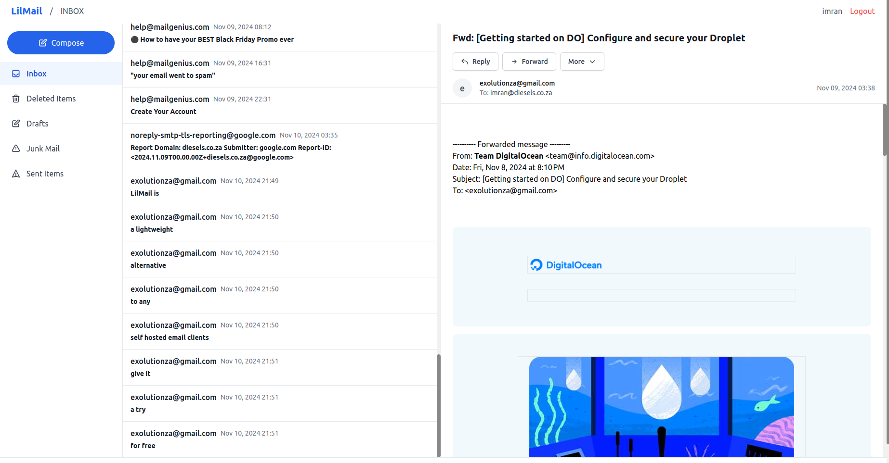

# LilMail 📧



[](https://github.com/exolutionza/lilmail/actions)
[](https://opensource.org/licenses/MIT)
<!-- [](https://github.com/exolutionza/lilmail/releases/latest) -->
<!-- [](https://goreportcard.com/report/github.com/exolutionza/lilmail) -->
A lightweight, resource-efficient webmail client written in Go, supporting IMAP and SMTP protocols. LilMail emphasizes simplicity and minimal system requirements, with a file-based storage system that eliminates the need for a database.

## ✨ Features

- 🚀 **Simple Setup**: Just run the binary - no complex configuration needed
- 💡 **Minimal Resource Usage**: Designed to run on low-end hardware
- 🗄️ **No Database Required**: All data stored efficiently on disk
- 📥 **IMAP Support**: Connect to any IMAP-enabled email server
- 📤 **SMTP Integration**: Send emails through standard SMTP protocols
- 💾 **File-Based Caching**: Reliable storage without external dependencies
- 🔒 **JWT Authentication**: Secure user sessions
- 🔐 **Encryption**: Built-in encryption for sensitive data

## 🖥️ System Requirements

- Memory: 64MB RAM minimum
- Storage: Depends on cache size (approximately 1GB recommended)
- OS: Linux, macOS, or Windows

## 🚀 Quick Start

```bash
# Clone the repository
git clone https://github.com/exolutionza/lilmail.git

# Navigate to project directory
cd lilmail

# Run the application
go run main.go
```

## ⚙️ Configuration

Create a `config.toml` file in the root directory:

```toml
[imap]
server = "mail.example.com"
port = 993
tls = true

[cache]
folder = "./cache"

[jwt]
secret = "your-secure-jwt-secret"

[encryption]
key = "your-32-character-encryption-key"

[smtp]
# If not specified, SMTP server will be derived from IMAP server
server = "mail.example.com"
port = 587
use_starttls = true
```

### Configuration Options Explained

- **IMAP Settings**:
  - `server`: Your IMAP server address
  - `port`: IMAP port (typically 993 for SSL/TLS)
  - `tls`: Enable/disable TLS connection

- **Cache Settings**:
  - `folder`: Local directory for storing cached mail data

- **JWT Settings**:
  - `secret`: Secret key for JWT token generation
  - ⚠️ Change this to a secure random string in production

- **Encryption Settings**:
  - `key`: 32-character key for encrypting sensitive data
  - ⚠️ Change this to a secure random key in production

- **SMTP Settings**:
  - `server`: SMTP server address (optional - defaults to IMAP server)
  - `port`: SMTP port (typically 587 for STARTTLS)
  - `use_starttls`: Enable STARTTLS for SMTP connection

## 📝 Usage

1. Configure your `config.toml` file
2. Run the application:
```bash
go run main.go
```
3. Access the webmail interface at `http://localhost:8080` (default port)

## 🏗️ Building and Releasing

To build the project:

```bash
# Build for current platform
go build -o lilmail

# Build for specific platforms
GOOS=linux GOARCH=amd64 go build -o lilmail-linux-amd64
GOOS=windows GOARCH=amd64 go build -o lilmail-windows-amd64.exe
GOOS=darwin GOARCH=amd64 go build -o lilmail-darwin-amd64
```

## 🤝 Contributing

Contributions are welcome! Please feel free to submit a Pull Request.

## 📄 License

This project is licensed under the MIT License - see the [LICENSE](LICENSE) file for details.